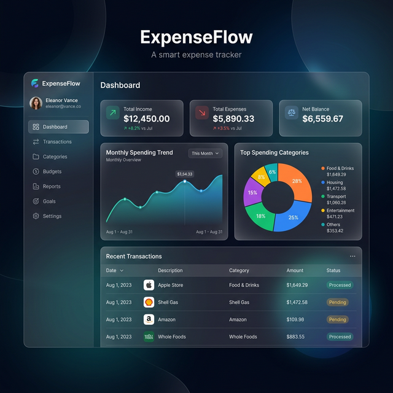

# ExpenseFlow - Smart Expense Tracker

ExpenseFlow is a modern, glassmorphism-inspired expense tracking application designed to help users manage their finances with style and ease.

## Features

- **Dashboard**: Real-time summary of income, expenses, and balance.
- **Visual Analytics**: Interactive charts powered by Chart.js.
- **Friends Tracking**: Easily manage shared expenses and balances with friends.
- **Glassmorphism UI**: Beautiful, semi-transparent design for a premium feel.
- **Export Options**: Export your data to PDF, Excel, or JSON.
- **Budgeting**: Set monthly budgets and track your spending progress.

## Tech Stack

- HTML5, CSS3 (Vanilla CSS with Glassmorphism)
- JavaScript (Vanilla JS)
- Chart.js
- jsPDF
